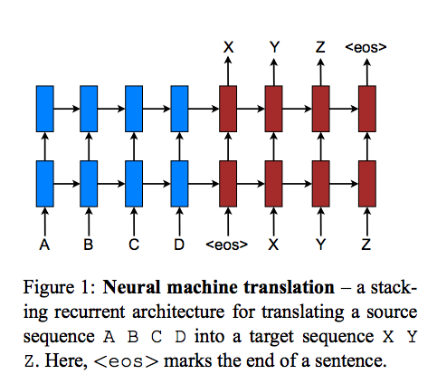

# Attention-based Neural Machine Translation (NMT)

2017-04-15 jkang  
python3.5  

### This tutorial covers following concepts for NMT (based on [Luong et al., 2015](https://arxiv.org/pdf/1508.04025.pdf)):
* What is NMT?
    * Definition of NMT
    * Loss function  
 
* What is **'Attention-based'** NMT?
    * Definition of attention
    * Hard attention? Soft attention?
    * How to model attention?

### What is Neural Machine Translation (NMT)?
* Definition  
    * According to [Luong et al., 2015](https://arxiv.org/pdf/1508.04025.pdf), NMT is "a Neural Network that directly models the __**conditional probability**__ $p(y|x)$ of translating a source sentence ($x_1, x_2, ... x_n $) to a target sentence ($y_1, y_2, ... y_n $)".  
    * This means, NMT learns the probability of target language given  source language.
    * Here is the **conditional probability**:
    
    > $\begin{align*}
\log{p(y|x)} &= \sum_{j=1}^m {\log{p(y_j|y_{<j}, \mathbf{s})}} \\
&= \log {\prod_{j=1}^{m} p(y_j|y_{<j}, \mathbf{s})} \qquad ...What\ does\ it\ mean??\ \\
\end{align*}$
    * Let's break down the equation above
    * The left-side log probability, $\log{p(y|x)}$, simply means finding the best sequence of translation. 
    > For example, think about English to Korean translation.  
    > if $x$ is "I want an apple" (English), $y$ will be "나는 사과 한개를 원해" (Korean).  
    > $\log{p(y|x)}$ will assign the highest log probability to "나는 사과 한개를 원해", not "나는 감자 한개를 원해".  
    * The right side of the sum of log probabilities, $\sum_{j=1}^m {\log{p(y_j|y_{<j}, \mathbf{s})}}$, includes the actual process of **decoding** the source sentence "I want an apple".

* Loss function
    * So, NMT has two parts: encoder and decoder
    * Output translation comes only in decoder part
    * Let's look at the figure to make it clear
    * From [Luong et al., 2015](https://arxiv.org/pdf/1508.04025.pdf):  
    {:height="36px" width="36px"}